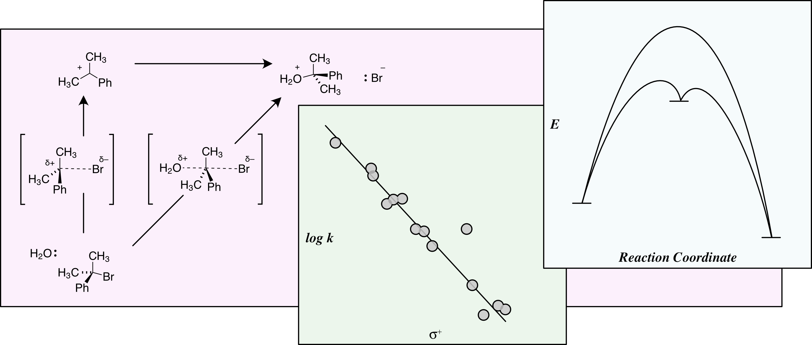

# Physical Organic Chemistry
Welcome to the course information for **Chemistry 4410**, Physical Organic Chemistry. In this book you will find the **syllabus** and outline, followed by a detailed description of class activities for **each lesson** in the course.

## Preface

It all boils down to this. **Physical organic chemistry** unites all the fields and all the tools of chemistry in its relentless search for patterns. Can we use the observations in one system to predict the outcome of another? That is the question here.

This search involves data. How do we **measure rates and energies** in changing chemical systems? How do we **design  experiments** so that these measurements can reveal the inner workings of chemical reactions? How do we use that data to **make predictions** that guide the creation of new methods and new molecules? 

At the end of this course you will be able to better propose **mechanisms for chemical reactions**, investigate your hypothesis and understand how to apply that information to predict the outcomes of related reactions. You will use these skills in this course by exploring examples of physical organic chemistry as it applies to **catalysis** of reactions, **enzyme chemistry and drug design**, and the true nature of **electronic structure** in molecules and how that controls their destiny. 

## Table of Contents

### [Course Syllabus](Info/Course_Info)

All the important **information** about the course is here. The **textbook**, the instructor, the **topics**, the grading scheme, the **rules**, etc.

### [Lessons](Lessons/Lesson_01)

The lessons track each week of the course. Each lesson will contain **details** about readings, assignments, presentations and quizzes. Always **read ahead** to next week's lesson.